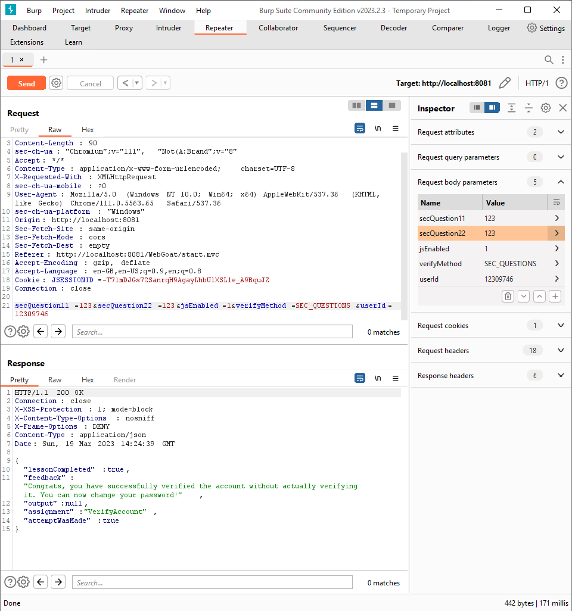
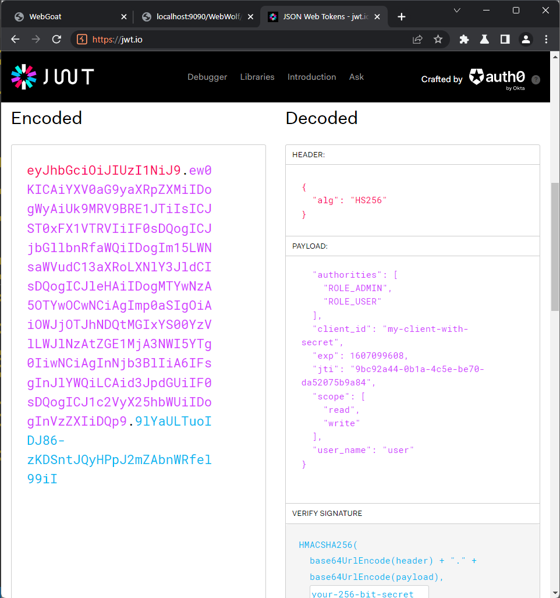
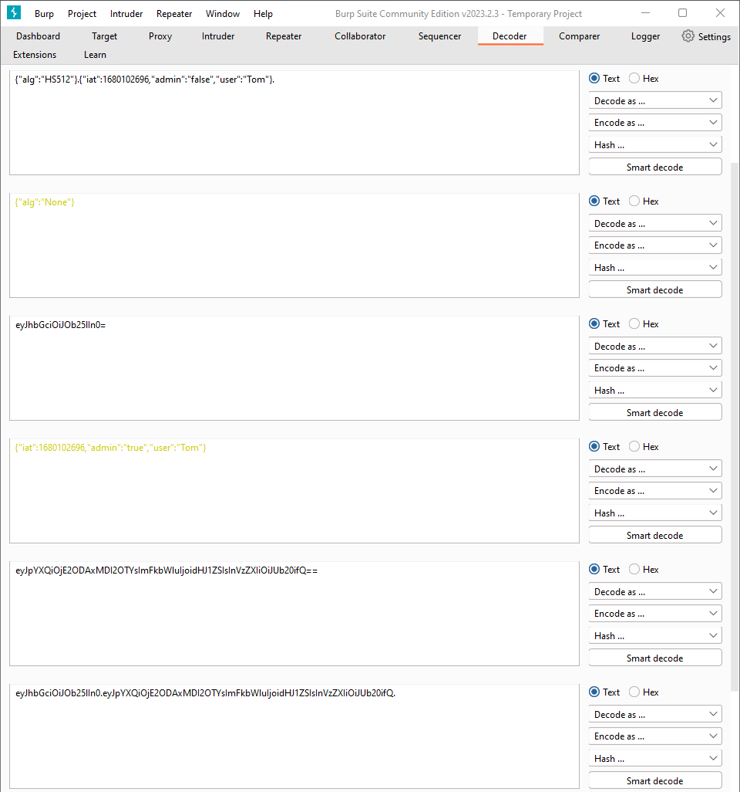
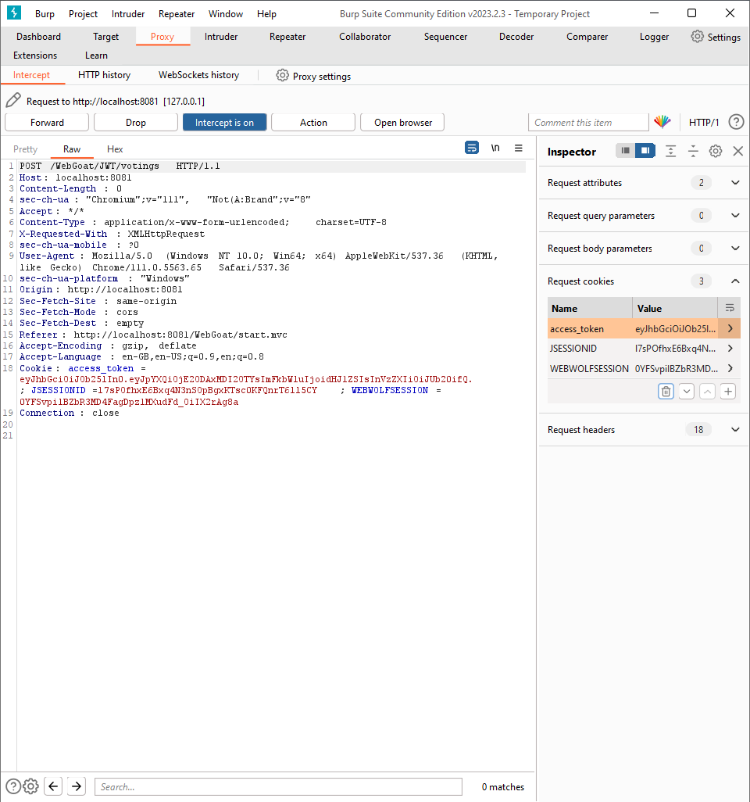
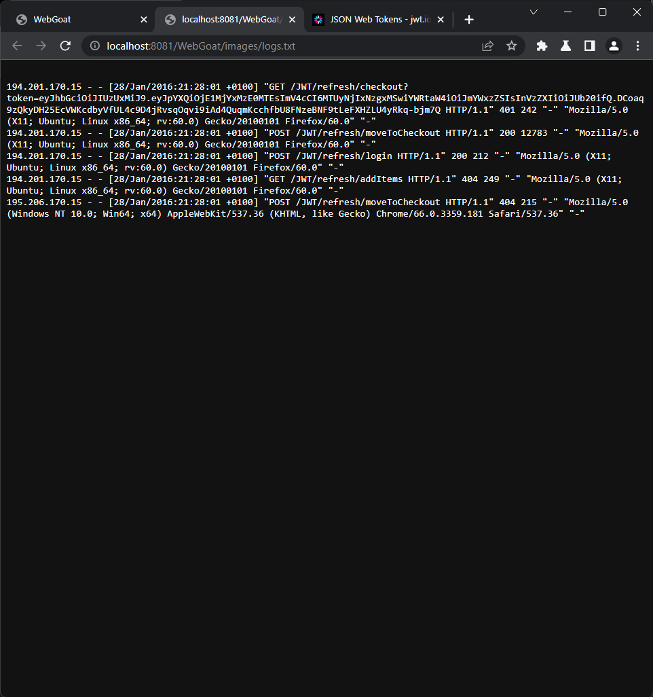
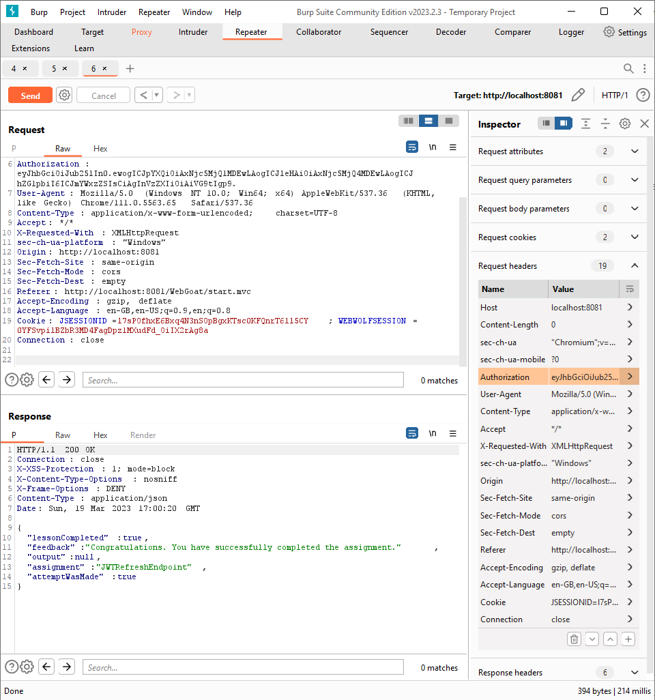
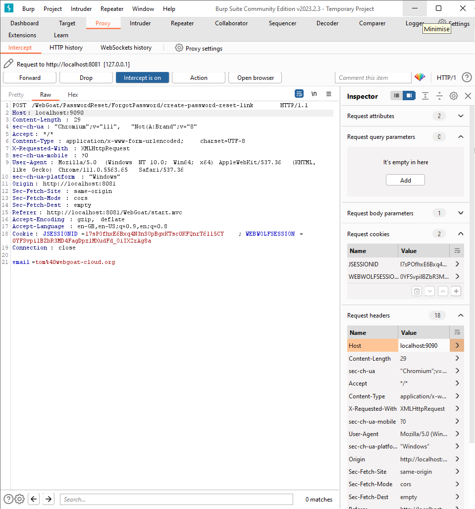
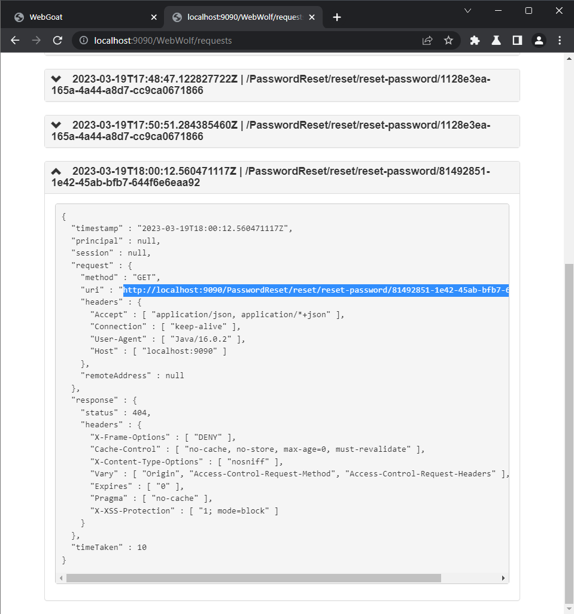

# (A2) Broken Authentication

## Authentucation Bypasses

### Lesson 2: 2FA Password Reset

The story described says that user deleted items using proxy and logged in. It does not work here, but changing body parameters to `secQuestion11` and `secQuestion22` solves problem.



## JWT tokens

### Lesson 3: Decoding a JWT token

Copy and paste the given token and decode the token. You can use webwolf or this [page](https://jwt.io/)



### Lesson 5: JWT signing

The goal of this lesson is to log in as `admin` and reset votes.

- First login as Tom

- Click bin icon

- Catch the votings request, select the `access-token` and send it do decoder. Then edit JWT by changing `alg` from `HS512` to `None`, and `admin` from `false` to `true`. Then concatenate results with dot, remember to add dot at the end

  

- Paste prepated JWT into `access-token` and forward request

  

- Done

### Lesson 7: Code review

Answer the questions.

1. Solution 1: Throws an exception in line 12

2. Solution 3: Logs an error in line 9

### Lesson 8: JWT cracking

Given we have the token try to find out secret key and submit a new key with the username changed to WebGoat.

- Decode the given token like in [Lesson 3](#lesson-3-decoding-a-jwt-token)

- Change `username` to `WebGoat`

- Copy jwt into `jwt.txt`

  ``` bash
  echo -n "..." >> jwt.txt
  ```

- Install `hashcat`

  ``` bash
  sudo apt update
  sudo apt upgrade -y
  sudo apt install hashcat -y
  ```

  Then download `rockyou` dictionary into `/usr/share/wordlists`

  ``` bash
  sudo wget https://github.com/brannondorsey/naive-hashcat/releases/download/data/rockyou.txt
  ```

- Run `hashcat`

  ``` bash
  hashcat --show -m 16500 -a 0 jwt.txt /usr/share/wordlists/rockyou.txt  
  ```

  The result is `business`

- Then sign token with changed username and paste it into input

### Lesson 10: Refreshing a token

The aim is to change JWT in such way that Tom will pay for books.

- Open logfile from assignment

  

- Decode the given token like in [Lesson 3](#lesson-3-decoding-a-jwt-token) and [Lesson 8](#lesson-8-jwt-cracking)

- Change first section to `{"alg":"None"}` and encode it in `base64`

  ``` bash
  echo -n '{"alg":"None"}' | base64
  ```

  to get `eyJhbGciOiJOb25lIn0=` and remove `==` to get `eyJhbGciOiJOb25lIn0`

- Go to this [page](https://www.unixtimestamp.com/) and prepare `iat` and `exp` times. Then encode payload in `base64` and concatenate using dot and add extra dot at the end

- Chatch request and put prepared token into `Authorization` header

  

### Lesson 11: Final challenge

- Grab the token from request query params and decode it

- Prepare request in such way

  

  1. `kid` to `' UNION SELECT 'YWFhYWFh' FROM INFORMATION_SCHEMA.SYSTEM_USERS; --`
  2. `iat` and `exp` to current time
  3. `sub`, `username` and `Email` to `Tom`
  4. signature to `YWFhYWFh` and check `secret base64 encoded` checkbox

- Change jwt in request and send it

## Password reset

### Lesson 2: Email functionality with WebWolf

- Click `Forgot password?` and send email
- Open WebWolf
- The password is your username backwards

### Lesson 4: Security questions

This lesson is just about guessing colors. It\`s easy.

- tom: purple
- admin: green
- larry: yellow

### Lesson 5: The Problem with Security Questions

- Select `What was the time you were born ?` and click `check`

### Lesson 6: Creating the password reset link

- Copy `tom@webgoat-cloud.org`
- Go to `Forget your password?` subpage and send mail to Tom
- Change `Host` header value to `localhost:9090`

  

- Go to WebWolf and get uri from the request

  

- Change `9090` to `8081/WebGoat` and go to the page
- Reset password
- Log in to Tom\`s account

## Secure Passwords

### Lesson 4: How long could it take to brute force your password?

go to [lastpass password generator](https://www.lastpass.com/features/password-generator#generatorTool) and generate 20 characters long password eg. `YTBC&05B1PJ!F8GI&o5z`
