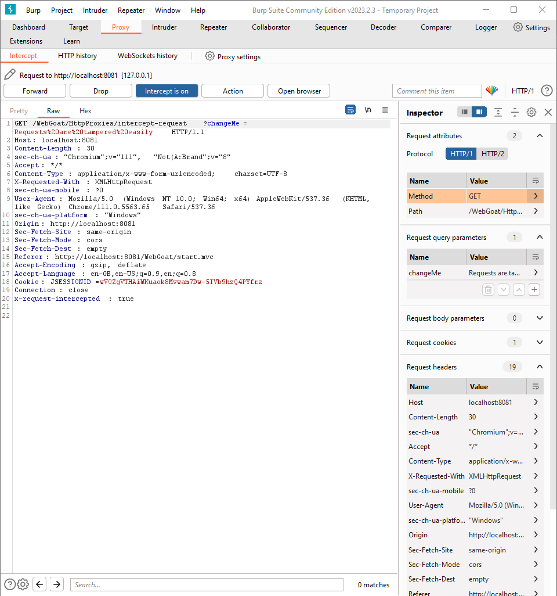
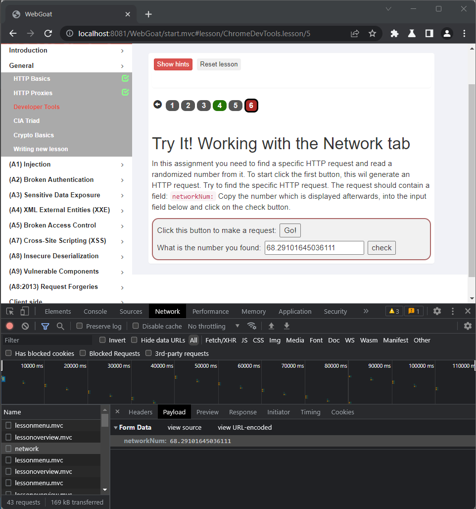

# General

## HTTP Basics

### Lesson 2: Intro

Enter your name in the input field below and press "Go!"

- `254622`

### Lesson 3: The Quiz

- `POST`
- Magic number is hidden under HTML code inside hidden input `#magic_num`

    ``` js
    parseInt(document.querySelector("#magic_num").value)
    ```

## HTTP Proxies

### Lesson 6: Verify if proxy is working

The goal of this lesson is to verify whether the proxy is correctly configured. Thus you need to press "Submit" button and change following fields in request. Do not forget to turn interception on.

- Change the HTTP Method to `GET`
- Add a header `x-request-intercepted:true`
- Remove request body
- add query parameter `changeMe=Requests%20are%20tampered%20easily`



*Do not forget to turn interception off, so next requests might be catched by Burp Suite.

## Developer Tools

### Lesson 4: Console tab

Open `Developer Tools` and `console`. Then run given javascript function:

``` js
webgoat.customjs.phoneHome()
```

In the feedback there will be `output` field with something like "phoneHome Response is 1747405744". Copy number and paste it into input on the page.

### Lesson 6: Network tab

In this assignment you need to find a specific HTTP request and read a randomized number from it. To start click the first button, this wil generate an HTTP request. Find `network` request, then go to `Payload` tab and grab randomly generated number and paste it into input.


## CIA Traid

### Lesson 5: The Quiz

1. Solution 3: By stealing a database where names and emails are stored and uploading it to a website.
2. Solution 1: By changing the names and emails of one or more users stored in a database.
3. Solution 4: By launching a denial of service attack on the servers.
4. Solution 2: The system's security is compromised even if only one goal is harmed.

## Crypto Basics

### Lesson 2: Base64 encoding

The target is to decode given `base64` login and password.

``` bash
echo -n MjU0NjIyOnBhc3N3MHJk | base64 --decode
```

it returns `login:password` eg. `254622:passw0rd`.

### Lesson 3: Other encoding

use this [page](https://strelitzia.net/wasXORdecoder/wasXORdecoder.html) to decode this text.

`{xor}Oz4rPj0+LDovPiwsKDAtOw==` -> `databasepassword`

### Lesson 4: Hashing

The goal is to find pre-images from 2 given hashes. Use this [page](https://www.cmd5.org/) to find them.

### Lesson 5: RSA

- create file id_rsa

    ``` bash
    echo "..." >> id_rsa
    ```

- get modulus by executing

    ``` bash
    openssl rsa -text -noout -in id_rsa
    ```

    there is `mod` in output but it is necessery to remove collons from it. So put it into file `echo -n "..." >> mod`.

    ``` bash
    sed 's/://g' mod > tmp_mod && mv tmp_mod mod
    tr -d '\n' < mod > tmp_mod && mv tmp_mod mod
    sed 's/[[:blank:]]//g' mod > tmp_mod && mv tmp_mod mod
    ```

- sign this file using the key

    ``` bash
    cat mod | openssl dgst -sign id_rsa -sha256 -out sign.sha256 && openssl enc -base64 -in sign.sha256 > sign && rm sign.sha256
    ```

- copy answers to inputs

    ``` bash
    cat mod
    cat sign
    rm mod sign id_rsa
    ```

### Lesson 8: Container digging

In this exercise you need to retrieve a secret that has accidentally been left inside a docker container image.

- Run docker container

    ``` bash
    docker run --name WebGoatCryptoAssignment --rm -d webgoat/assignments:findthesecret
    ```

- copy passwd file into your local machine

    ``` bash
    docker cp WebGoatCryptoAssignment:/etc/passwd passwd
    ```

- change `webgoat` user group to `0:0`.
- copy passwd file bact to docker container

    ``` bash
    docker cp passwd WebGoatCryptoAssignment:/etc/passwd
    ```

- Enter container

    ``` bash
    docker exec -it WebGoatCryptoAssignment /bin/bash
    ```

- Move into `/root`

    ``` bash
    cd /root
    ```

- Decode message

    ``` bash
    echo "U2FsdGVkX199jgh5oANElFdtCxIEvdEvciLi+v+5loE+VCuy6Ii0b+5byb5DXp32RPmT02Ek1pf55ctQN+DHbwCPiVRfFQamDmbHBUpD7as=" | openssl enc -aes-256-cbc -d -a -kfile default_secret
    ```

- Copy and paste message into input.

#### Alternative easier solution

- Run docker container

    ``` bash
    docker run --name WebGoatCryptoAssignment --rm -d webgoat/assignments:findthesecret
    ```

- Enter container as root

    ``` bash
    docker exec -it -u root WebGoatCryptoAssignment -u root /bin/bash
    ```

- Move into `/root`

    ``` bash
    cd /root
    ```

- Decode message

    ``` bash
    echo "U2FsdGVkX199jgh5oANElFdtCxIEvdEvciLi+v+5loE+VCuy6Ii0b+5byb5DXp32RPmT02Ek1pf55ctQN+DHbwCPiVRfFQamDmbHBUpD7as=" | openssl enc -aes-256-cbc -d -a -kfile default_secret
    ```

- Copy and paste message `Leaving passwords in docker images is not so secure` into input. File name is `default_secret`
